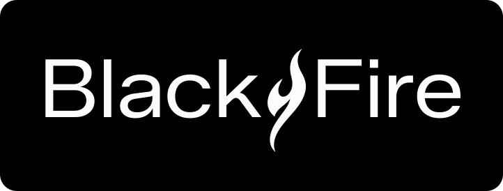

---
language:
- ne
- en
license: cc-by-nc-4.0
library_name: transformers
pipeline_tag: automatic-speech-recognition
tags:
- automatic-speech-recognition
- nepali
- devanagari
- punctuation
base_model: Edge0/Audio8-ASR-0.1B
extra_gated_prompt: >-
  This model inherits the CC BY-NC 4.0 licence of its base model and may not be
  used for commercial purposes.
---



# Nepali ASR with punctuation (aud8, 325M)

Speech recognition for Nepali that outputs punctuated text. A fine-tune of
[Edge0/Audio8-ASR-0.1B](https://huggingface.co/Edge0/Audio8-ASR-0.1B) on 66.9 hours of
Nepali and 9.7 hours of English, with a Devanagari-extended tokenizer and a decoder
adapted on 6.57M tokens of Nepali text.

325M parameters, 16 kHz mono input, 30 second hard cap per call.

## Which model do you want

We publish two Nepali ASR models for different jobs.

| | this model (aud8) | [nepali-asr-xlsr-300m](https://huggingface.co/BlackfireAI/nepali-asr-xlsr-300m) |
|---|---|---|
| punctuation | yes | no |
| English inside Nepali speech | partially handled | not at all |
| accuracy on plain Nepali | good | better |
| speed | needs a GPU, below realtime on CPU | fast, many times realtime on CPU |
| length limit | 30 seconds per call | none |

**This is the slower and less accurate of the two.** What it gives you in exchange is
readable text with sentence boundaries, which the XLS-R model cannot produce at all.

Pick this one when the output will be read by a person and you have a GPU. Pick XLS-R for
throughput, CPU deployment, long audio, or when raw accuracy matters more than formatting.

## Usage

Requires `transformers>=4.50,<5`. Tested on 4.57.6. On transformers 5.x this model
produces garbage output rather than failing loudly, so pin the version.

```python
import torch
from transformers import AutoModelForCausalLM, AutoProcessor

name = "BlackfireAI/nepali-asr-aud8-325m"
processor = AutoProcessor.from_pretrained(name, trust_remote_code=True)
model = AutoModelForCausalLM.from_pretrained(
    name, trust_remote_code=True, dtype=torch.bfloat16,
    attn_implementation="eager").eval().cuda()

conversation = [{"role": "user", "content": [
    {"type": "audio", "path": "audio.wav"},
    {"type": "text", "text": "Please transcribe this audio."}]}]
batch = dict(processor.apply_chat_template(
    conversation, add_generation_prompt=True, return_tensors="pt",
    sampling_rate=16000, audio_padding="longest", audio_max_length=30 * 16000,
    text_kwargs={"padding": "longest", "truncation": True, "max_length": 1000}))
batch = {k: (v.cuda() if hasattr(v, "to") else v) for k, v in batch.items()}

out = model.generate(**batch, max_new_tokens=256, do_sample=False,
                     num_beams=5, no_repeat_ngram_size=4)
print(processor.decode(out[0, batch["input_ids"].shape[1]:], skip_special_tokens=True))
```

`num_beams=5` and `no_repeat_ngram_size=4` are not optional. Beam search on its own makes
character error worse than greedy decoding, because the language-model-adapted decoder
falls into repetition loops that beam search amplifies. The n-gram block is what stops it.
Use both or neither.

## Measuring it yourself

The evaluation script and test manifest are in the
[GitHub repository](https://github.com/BlackfireAI/nepali-asr-aud8). We are not publishing
our own scores for this model. Run it on audio that resembles your use case, which will
tell you more than our numbers would.

## Limitations

- 30 seconds maximum per call. Longer audio must be chunked.
- Slow. Autoregressive beam search runs below realtime on CPU. Use a GPU, or use the
  XLS-R model.
- Less accurate than our XLS-R model on plain Nepali.
- Punctuation placement is imperfect. Sentence boundaries are often right, mid-sentence
  commas and dandas frequently are not.
- Weak on heavy code-switching. Occasional English words inside Nepali are handled,
  sustained English is not.
- Requires `trust_remote_code=True`.
- Trained mainly on read and narrated speech.

## Licence

CC BY-NC 4.0, inherited from the base model. **Non-commercial use only.** This restriction
comes from upstream and cannot be lifted by us.

Attribution for derivatives: based on Edge0/Audio8-ASR-0.1B (CC BY-NC 4.0), fine-tuned
for Nepali by Blackfire A.I. Pvt. Ltd.

Code and evaluation tooling:
[github.com/BlackfireAI/nepali-asr-aud8](https://github.com/BlackfireAI/nepali-asr-aud8)
